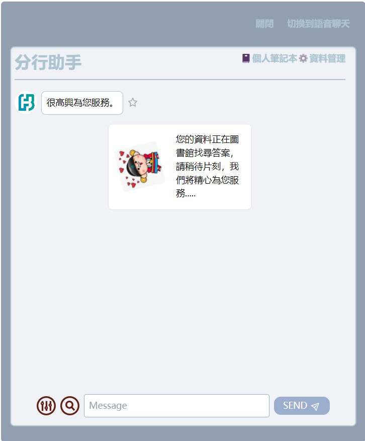
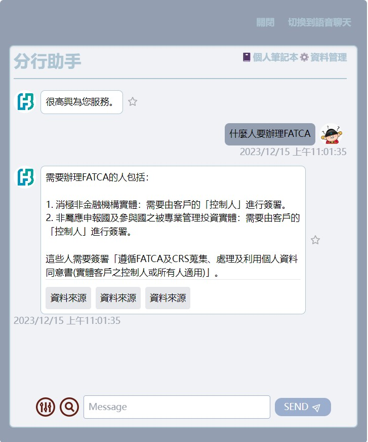
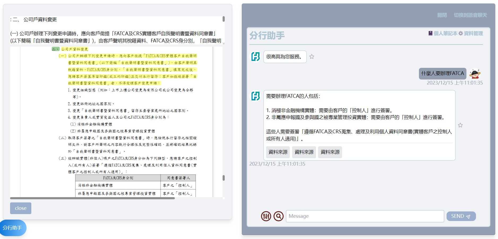
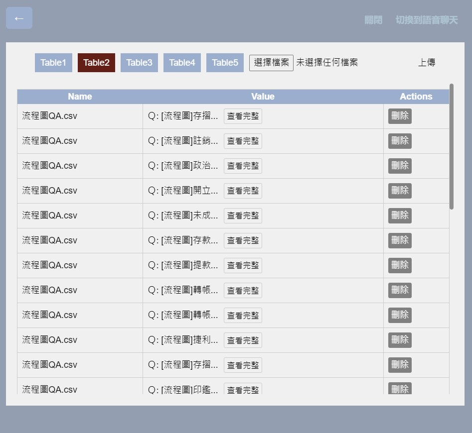

# Branch Assistant
## Introduction
This repository showcases a LangChain-based tool created to simplify and enhance internal information retrieval processes. Developed with Flask, this tool focuses on streamlining database interactions, with the ultimate aim of reducing training time for new staff and accelerating customer response times through an efficient, user-friendly interface.

## DEMO
### After inputting relevant questions, it will start internal data retrieval

### Answering questions through internal information, including the data sources for three answers

### When the data source is opened, it will display the entire PDF file and highlight the relevant section.

### You can upload internal data and instantly view, manage, and delete it

### Open the Website
- The website is currently awaiting deployment